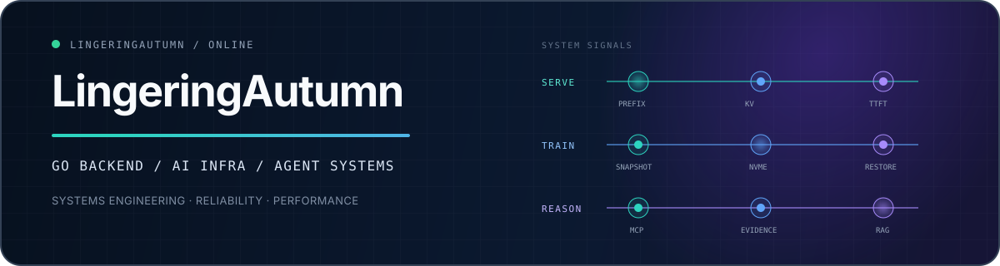

<p align="center">
  
</p>

<p align="center">
  <a href="https://github.com/west2-online">West2 Online</a>
  ·
  <a href="https://github.com/west2-online/DomTok">DomTok</a>
  ·
  <a href="https://github.com/LingeringAutumn?tab=repositories">All repositories</a>
</p>

I am **LingeringAutumn**, a systems-focused developer working across low-latency model serving, distributed training, GPU data pipelines, and evidence-driven agents.

| Now | Previously | Interested in |
| --- | --- | --- |
| Building ML infrastructure for embodied VLM/VLA development | Database platform engineering for managed relational databases | Opportunities in **AI Infra, Go backend, and agent engineering** |

## Community

**[West2 Online / 西二在线](https://github.com/west2-online) · Go Group**

Member of the Go group, building backend and infrastructure projects through collaborative development and open-source practice. Contributed to **[DomTok](https://github.com/west2-online/DomTok)**, an AI-enabled distributed e-commerce backend.

## Selected engineering impact

| System | What I built | Engineering outcome |
| --- | --- | --- |
| **LLM serving** | Prefix-aware, cross-instance KV cache reuse across VRAM, DRAM, and SSD | Reduced redundant prefill work and improved cache-hit latency under prefill-heavy workloads |
| **Distributed training** | Asynchronous sharded checkpoints with NVMe/object-storage persistence and parallel recovery | Moved persistence off the training critical path and accelerated cross-cluster recovery |
| **GPU data pipeline** | NVDEC + PyTorch video decode, resize, grayscale, and motion-feature extraction | Eliminated per-frame CPU round-trips while preserving end-to-end decisions |
| **Database platform** | OOM-safe asynchronous workflow with sharding, cursor pagination, idempotent retries, and bounded concurrency | Bounded memory and concurrency for high-fan-out metadata workloads |

## Selected projects

### [DomTok](https://github.com/west2-online/DomTok)

An AI-enabled distributed e-commerce backend built with **Go, Kitex, Hertz, Redis, Kafka, OpenTelemetry, and Docker**. The project won **1st place in the 2025 ByteDance Youth Training Camp backend track** and includes clean architecture, service observability, CI, tests, and an LLM function-calling workflow.

### [MIT 6.5840 — MapReduce](https://github.com/LingeringAutumn/MIT_6_5840)

A Go implementation of the MIT 6.5840 MapReduce lab, covering coordinator/worker RPC, task scheduling, timeout recovery, concurrent execution, and fault handling.

### [FigTabMiner](https://github.com/LingeringAutumn/FigTabMiner)

An **AI-for-Science** pipeline that turns figures and tables in research PDFs into structured, ML-ready assets. It combines document-layout models, caption-constrained correction, boundary refinement, OCR, provenance tracking, and JSON/CSV export.

## Technical focus

```text
Languages      Go · Python · SQL
AI Infra      Transformer inference · PagedAttention · Prefix Caching · KV Cache
Agents        Multi-agent orchestration · MCP · RAG · Context & evidence management
Data          MySQL · PostgreSQL · Redis · Kafka
Platform      Linux · Docker · Kubernetes · Git
```

> I design for the hot path, the failure path, and the evidence trail.

<p align="center">
  <b>Open to opportunities in AI Infra, Go backend, and agent engineering.</b>
</p>
